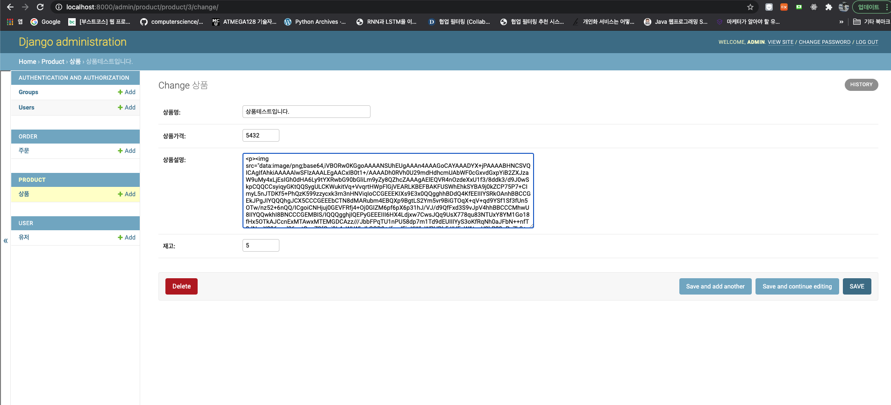

# Class based view 를 이용한 개발.
- 중복되는 코드를 줄일 수 있다.

## 글 + 이미지 등록할때 궁금했던것 오늘 해결 !

- summernote 라는 에디터 사용(js)
- 여기에 삽입한 이미지는 자동으로 base64 인코딩되며, 작성한 텍스트의 경우 태그로서 존재한다.
- 이를 그대로 DB에 작성하면 html 포맷으로 모두 저장되며, 나중에 이를 불러왔을때 그대로 보여진다.
- 다만 이렇게 base64이미지를 곧장 RDB에 박는게 좋은가? 라는 의문점은 생긴다. (퍼포먼스 이슈?)

- summernote 에디터 사용 화면

- 실제 DB에 들어간 값